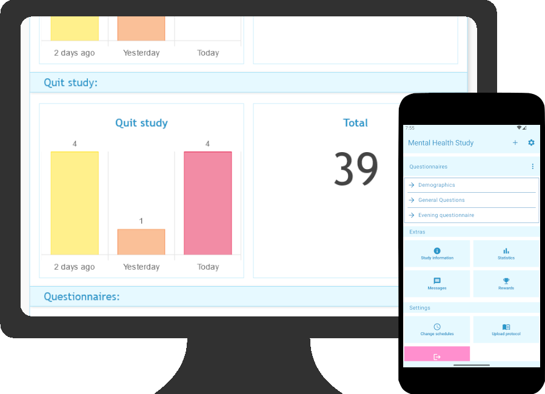

	

	
	 
	<a href="https://esmira.kl.ac.at/?about">[Screenshots]</a>
	<a href="https://github.com/KL-Psychological-Methodology/ESMira/wiki">[Wiki]</a>
	<a href="https://github.com/KL-Psychological-Methodology/ESMira/discussions">[Forum]</a>

ESMira is a tool developed for research projects using Experience Sampling Method (ESM, AA, EMA, ...) designs. ESMira offers a very simple set-up process and ease of use, while being free, decentralized, and open-source. Study administrators can install ESMira on their own webspace without needing much technical knowledge, allowing them to remain independent from third-party services.

	

## :globe_with_meridians: Translations for ESMira

	

We have set up a platform were you can help us translate ESMira:
<https://translate.jodli.dev/projects/esmira/>

If you need ESMira in a language that is not listed, please inform us in [the discussions](https://github.com/KL-Psychological-Methodology/ESMira/discussions), and we will add your language.

## :information_source: I want to know more
If you want a list of features and screenshots, head over to <https://esmira.kl.ac.at/?about>.
You can also have a look at our [wiki](https://github.com/KL-Psychological-Methodology/ESMira/wiki). If you want to get in touch with us, you are always welcome to open a thread in [the discussions](https://github.com/KL-Psychological-Methodology/ESMira/discussions).

## :hammer_and_pick: How can I use it?
All you need is a simple webserver that has PHP installed. Just copy the [necessary files](https://github.com/KL-Psychological-Methodology/ESMira-web/releases/download/latest/ESMira-web.zip) onto your server, open the main page of ESMira and follow the instructions. Follow [this guide](https://github.com/KL-Psychological-Methodology/ESMira/wiki/Setting-up-a-server) for more information.
Please also cite ESMira in your publications. [Read more here](https://github.com/KL-Psychological-Methodology/ESMira/wiki/Conditions-for-using-ESMira) 

## :bug: Something is not working / I need a feature
We are always interested in hearing how ESMira can be improved. Please open [a new issue](https://github.com/KL-Psychological-Methodology/ESMira/issues) or open a thread [in the discussions](https://github.com/KL-Psychological-Methodology/ESMira/discussions).

## :helicopter: I want to help you
Great! Please have a look [in here](https://github.com/KL-Psychological-Methodology/ESMira/wiki/Help-development). If you still have questions, we are happy to assist you [in the discussions](https://github.com/KL-Psychological-Methodology/ESMira/discussions).

## :atom: Where is the source code?
ESMira is split into two sub-modules:
* The server called [ESMira-web](https://github.com/KL-Psychological-Methodology/ESMira-web)
* Its smartphone apps called [ESMira-apps](https://github.com/KL-Psychological-Methodology/ESMira-apps)

The server is where study administrators can set up studies, communicate with participants, and where all study data are stored. The smartphone app (Android, iOS) is used by participants to participate in studies.

## :mortar_board: Who is maintaining this project?
The project is developed at [Karl Landsteiner University](https://www.kl.ac.at/) and was initially financed by the FWF (Fonds zur Förderung der wissenschaftlichen Forschung; Project number: P3100-N38)

### Concept & design
* Univ.-Prof. Mag. Dr. Stefan Stieger, PD
* JodliDev / David Lewetz, MSc

### Responsible for progamming:
* JodliDev / David Lewetz, MSc

You can find the full Legal Notice at <https://esmira.kl.ac.at/?impressum>

## :link: Resources
- [Website](https://esmira.kl.ac.at/?about)
- [Wiki](https://github.com/KL-Psychological-Methodology/ESMira/wiki)
- [Discussion forum](https://github.com/KL-Psychological-Methodology/ESMira/discussions)
- [Translation platform](https://translate.jodli.dev/)
- [Help development](https://github.com/KL-Psychological-Methodology/ESMira/wiki/Help-development).